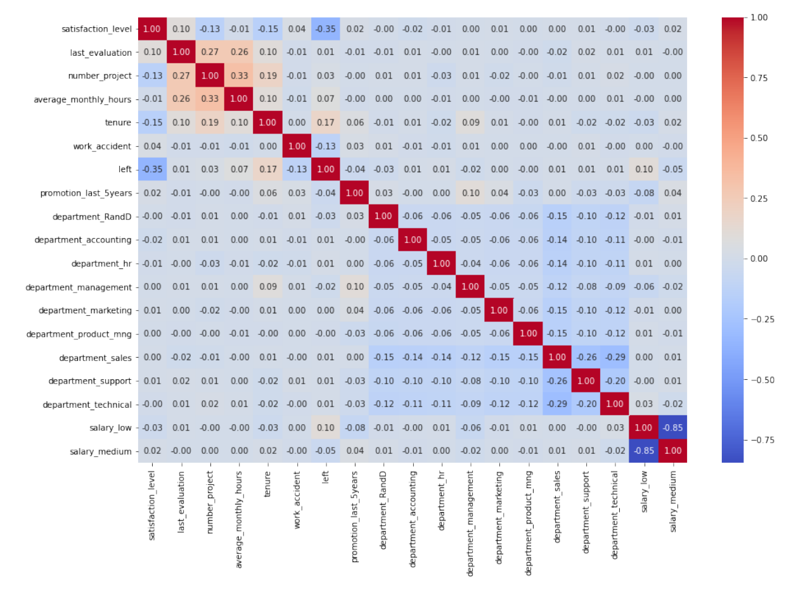
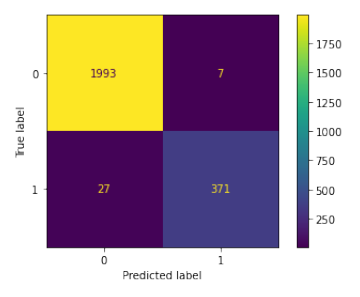
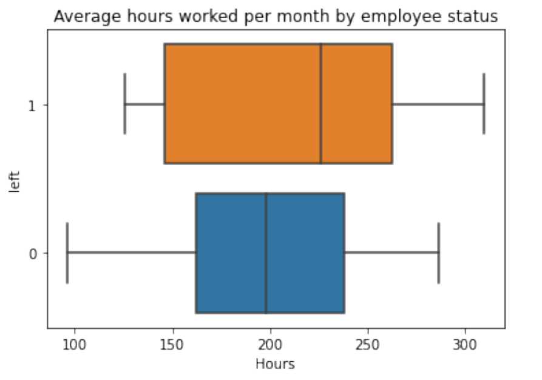
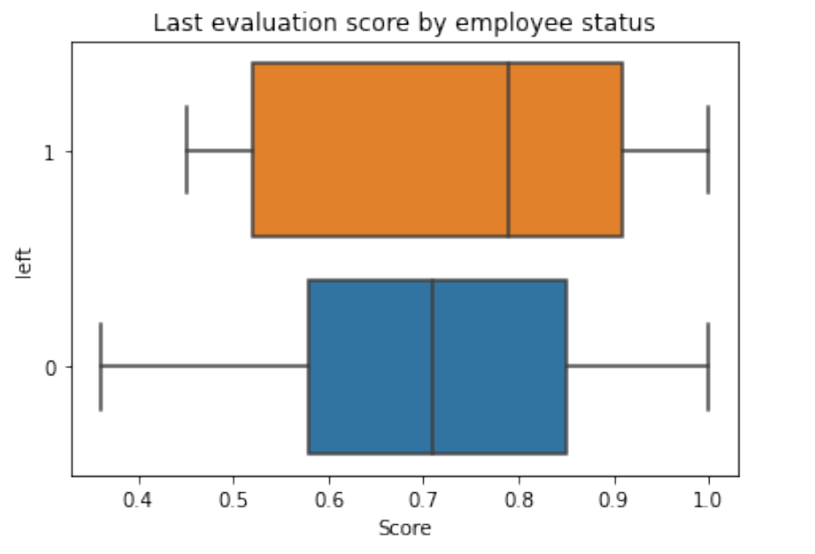

# Salifort-Motors-Employee-Attrition-Prediction
Analyzed a 15,000-record HR dataset to predict employee attrition using Random Forest and XGBoost classifiers. Performed EDA, feature engineering, and hyperparameter tuning via GridSearchCV. Champion XGBoost model achieved 98.3% accuracy and 97.1% precision.

*(Final project of the Google Advanced Data Analytics Certification)*

## Purpose
Employee turnover is costly. Salifort Motors was experiencing a high rate of attrition and needed a way to understand why employees were leaving and identify those most at risk before they walked out the door. HR collected survey data across the workforce, and this project was tasked with turning that data into something actionable.

## Objective
Build a machine learning model capable of accurately predicting whether an employee will leave the company, and uncover the primary workplace factors driving that decision.

## Dataset
- **Records:** 14,999 employees (11,991 after deduplication)
- **Features:** 10 workplace attributes including satisfaction level, performance score, number of projects, average monthly hours, tenure, department, and salary

## Approach
- Exploratory Data Analysis (EDA) with correlation heatmaps and boxplots
- Data cleaning: standardized column names, removed 3,008 duplicate records, identified tenure outliers via IQR method
- One-hot encoded categorical variables for modeling
- Built and compared **Random Forest** and **XGBoost** classifiers using `GridSearchCV` for hyperparameter tuning
- Evaluated models on accuracy, precision, recall, and F1-score

## Results
The XGBoost model outperformed the Random Forest and was selected as the champion model.

| Metric | Score |
|--------|-------|
| Accuracy | 98.3% |
| Precision | 97.1% |
| Recall | 92.7% |
| F1-Score | 94.9% |

Out of 2,399 test profiles, the model correctly predicted **2,359 outcomes** — missing only 29 employees who left and flagging 11 who stayed.

## Key Findings
Feature importance analysis ranked the top drivers of attrition as:

1. **Satisfaction level** — employees who left reported significantly lower satisfaction on average
2. **Tenure** — longer-tenured employees were more likely to leave
3. **Number of projects** — departing employees tended to be overloaded or underutilized
4. **Performance score** — employees who left scored higher on average, likely due to logging more hours
5. **Average monthly hours** — employees who left worked more hours per month on average

## Recommendations
Based on the findings, the following initiatives were recommended to HR leadership:

- **Set workload thresholds** — establish limits on monthly hours and project assignments to reduce burnout risk
- **Revise performance evaluations** — shift focus from hours worked to output quality and objective achievements
- **Increase feedback touchpoints** — implement regular check-ins and surveys targeting employees with lower satisfaction scores
- **Introduce retention incentives** — develop loyalty programs, career progression pathways, or compensation adjustments for employees in their highest-risk tenure years

## Tools Used
`Python` · `pandas` · `NumPy` · `scikit-learn` · `XGBoost` · `Matplotlib` · `seaborn`

## Visualizations
- Correlation Matrix

- Confusion Matrix (Predictions vs. Test Data)

- Boxplot 1

- Boxplot 2

